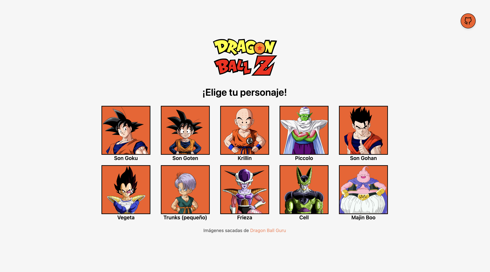

# Selector de Personajes de DBZ no oficial usando la View Transitions API

## ❗️ Motivación

Mi serie favorita y una forma novedosa de transicionar entre distintas páginas que pretende ser bastante popular en un futuro muy cercano. Vi cómo lo hizo [midudev](https://github.com/midudev/view-transitions-api-books-demo) y me decidí a probarlo por mi cuenta. Por el momento, la transición solo funciona en Chrome.

## © Copyright

Las imágenes están sacadas de [Dragon Ball Guru](https://dragonball.guru/)